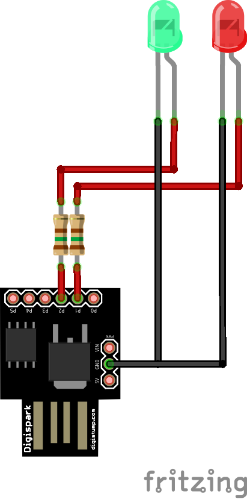

# ASCII Blink

This small device shows the ASCII representation of a text with the help of two blinking LEDs.

The two LEDs light up in sequence, imitating the bit sequence that represents the text in ASCII:

* the first LED represents bit values of 0;
* the second LED represents bit values of 1.

The characters of the text are shown from left to right, and bits are traversed from most significant (MSB) to least significant bit (LSB).

## Wiring

